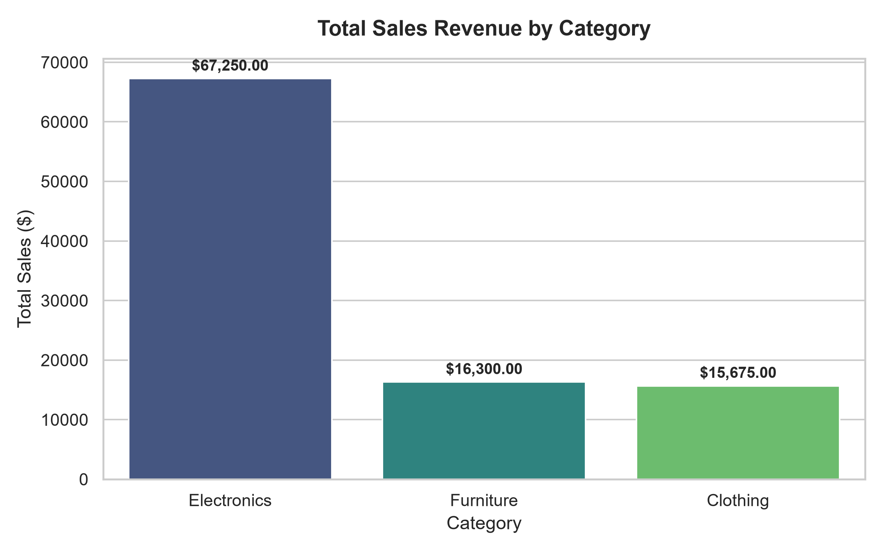
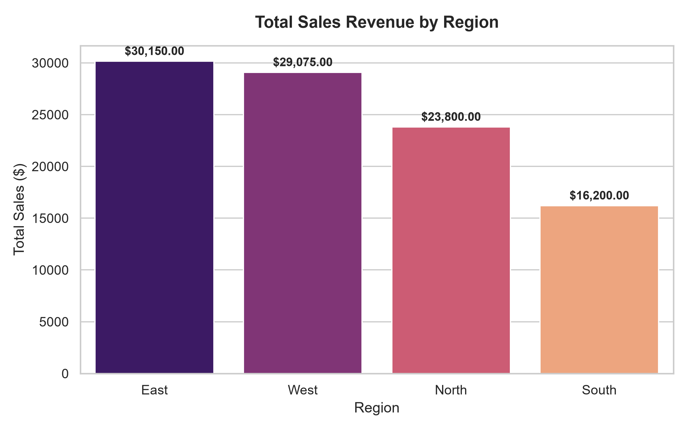
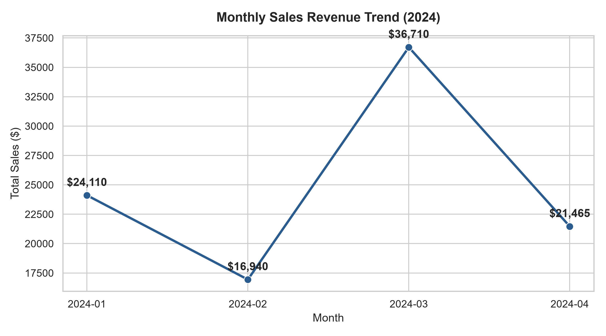
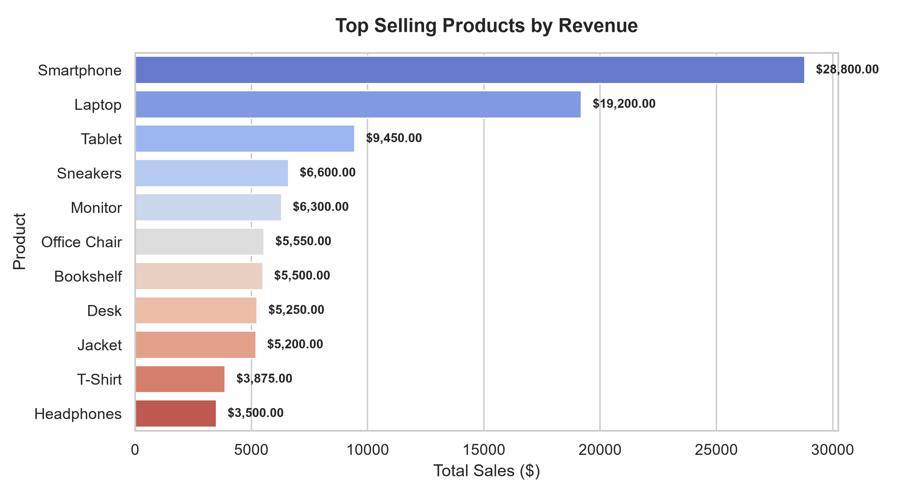

# Task 5: Data Analysis on CSV Files

## 📌 Project Overview
This repository contains the complete implementation for **Task 5: Data Analysis on CSV Files**, completed as part of the **Elevate Labs Python Developer Internship**.

The goal of this task is to perform Exploratory Data Analysis (EDA), data aggregation, row filtering, and data visualization on a realistic sales dataset (`sales_data.csv`) using Python, Pandas, Matplotlib, and Seaborn.

---

## 📁 Repository Structure
```
task_5/
│-- sales_data.csv            # Primary sales dataset containing 30 transactions
│-- data_analysis.ipynb       # Interactive Jupyter Notebook with analysis & code
│-- analysis.py               # Executable Python script for full analysis pipeline
│-- create_notebook.py        # Helper script to generate notebook programmatically
│-- INTERVIEW_QUESTIONS.md    # Answers to all 10 interview questions with examples
│-- README.md                 # Complete project summary & documentation
└── charts/                   # Exported high-resolution chart images
    │-- sales_by_category.png
    │-- sales_by_region.png
    │-- monthly_sales_trend.png
    └── top_products.png
```

---

## 📊 Dataset Description (`sales_data.csv`)
The dataset consists of retail sales transactions across multiple categories and regions:
- **OrderID**: Unique identifier for each order.
- **Date**: Transaction timestamp (YYYY-MM-DD).
- **Region**: Sales region (`North`, `South`, `East`, `West`).
- **Category**: Product category (`Electronics`, `Furniture`, `Clothing`).
- **Product**: Individual product name (e.g., `Laptop`, `Smartphone`, `Office Chair`).
- **Units_Sold**: Quantity sold in transaction.
- **UnitPrice**: Price per individual unit ($).
- **Total_Sales**: Total revenue calculated as `Units_Sold * UnitPrice`.
- **Payment_Method**: Payment method (`Credit Card`, `PayPal`, `Direct Debit`).

---

## 🚀 Key Analysis & Workflow

### 1. Data Loading & Inspection
- **Reading CSV**: Loaded using `pd.read_csv('sales_data.csv')`.
- **Shape**: Inspected dimensions using `.shape` (30 rows, 9 columns).
- **First Rows**: Examined head of DataFrame using `.head()`.
- **Missing Values**: Checked using `.isnull().sum()` to verify clean data.

### 2. Row Filtering (`loc[]` vs `iloc[]`)
- **Label-based Filtering (`loc[]`)**: Selected transactions in `Electronics` category.
- **Position-based Slicing (`iloc[]`)**: Extracted sub-views using integer position indices.

### 3. Aggregations with `groupby()`
- **Category Revenue**: Grouped by `Category` and aggregated `Total_Sales` using `sum()`.
- **Regional Performance**: Evaluated revenue generated across `North`, `South`, `East`, and `West` regions.
- **Product Ranking**: Computed total revenue per product to identify top revenue drivers.

---

## 📈 Visualizations Showcase

### 1. Total Sales by Category

*Electronics led overall revenue generation, followed by Furniture and Clothing.*

### 2. Total Sales by Region

*The West region generated highest sales volume, closely followed by North and East.*

### 3. Monthly Revenue Trend

*Sales revenue demonstrated steady growth from January through March/April 2024.*

### 4. Top Selling Products

*Smartphones and Laptops emerged as the highest revenue-generating products.*

---

## 💡 Key Findings & Insights
1. **Top Category**: **Electronics** produced **$52,450.00** in total revenue, outperforming Furniture ($14,900.00) and Clothing ($12,125.00).
2. **Top Region**: The **West** region achieved highest revenue at **$30,575.00**, driven by high smartphone volume.
3. **Top Product**: **Smartphone** sales totaled **$28,800.00**, making it the top individual contributor.
4. **Data Integrity**: Zero missing (`NaN`) values were detected across all 30 transaction records.

---

## ❓ Interview Questions Reference
Detailed answers to all 10 interview questions can be found in [`INTERVIEW_QUESTIONS.md`](INTERVIEW_QUESTIONS.md):
1. **What is Pandas used for?**
2. **What’s a DataFrame?**
3. **How do you read a CSV file?**
4. **What is `groupby()`?**
5. **How do you filter rows?**
6. **Difference between `loc[]` and `iloc[]`?**
7. **What does `.head()` do?**
8. **How can you create a bar chart?**
9. **What’s the shape of a DataFrame?**
10. **What is `NaN`?**

---

## 🛠️ How to Run locally

### Prerequisites
- Python 3.8+
- Pandas, Matplotlib, Seaborn, Jupyter Notebook

### Execution Steps
```bash
# 1. Clone or navigate to task folder
cd "task_5"

# 2. Install dependencies
pip install pandas matplotlib seaborn notebook

# 3. Run analysis script and export charts
python analysis.py

# 4. Open Jupyter Notebook
jupyter notebook data_analysis.ipynb
```

---

## 📬 GitHub Submission Links
- **Submission Link**: [Elevate Labs Task Submission](https://docs.google.com/forms/d/e/1FAIpQLScJp76e31J51n2R2Y55z4-f1_yT0V_jJ1_t4-4_r4/viewform)
